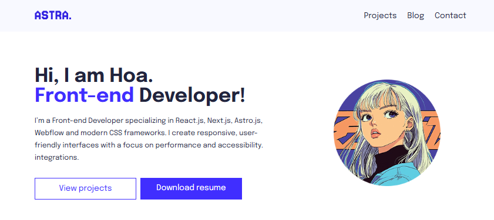

# Astro Portfolio

A modern, responsive portfolio website built with Astro 5.



## Features

- **Personal Header** - Introduction section with profile image and social links
- **Projects Section** - Showcase your work with project cards
- **Blog Section** - Content-driven blog with Markdown support
- **Skills Display** - Highlight your expertise (Front-end, Back-end, Design)
- **Responsive Design** - Optimized for all screen sizes
- **Fast Performance** - Built with Astro for minimal JavaScript

### Prerequisites

- Node.js 18+
- npm, pnpm, or yarn

### Installation

```bash
# Clone the repository
git clone <repository-url>
cd astro-portfolio

# Install dependencies
npm install
```

Open [http://localhost:4321](http://localhost:4321) in your browser.

## Tech Stack

- [Astro](https://astro.build) - Web framework
- [Epilogue](https://fonts.google.com/specimen/Epilogue) - Typography

